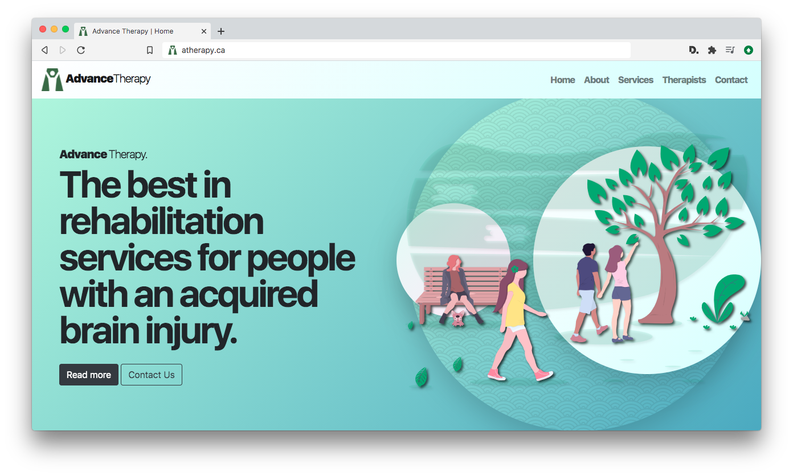

# Advance Therapy Official Website

## Intro

This is a repo for the official website of Guelph area health services provider **Advance Therapy**. For version 2.0, Advance required a redesign of their previous site (also developed by Mason Media) to expand the branding, design language, and company serives information, as well as update and modernize the previous layout. The project includes unDraw illustrations for humanistic icon/scenes, the extension of the company's brand and color palette, and the addition/editing of copy from the previous website. This iteration added subpages and employed the SWUP.js library for SPA-like AJAX loadless page transitions, and an app-style user experience.  It was built with a custom php component-style architecture, SASS, and the AOS scroll animation library.

Please see more at [andrewmasonmedia.com](https://dev2.andrewmasonmedia.com/).